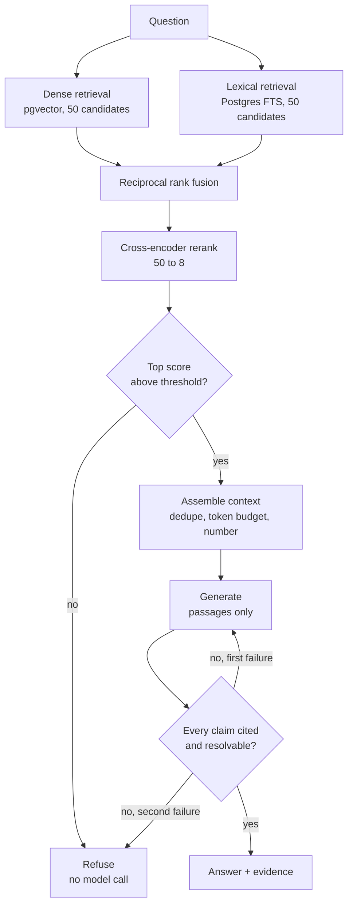

# Drug Label Retrieval

Answers medication questions from official FDA drug labelling — with a citation
on every factual claim, and a refusal when the labelling does not support an
answer.

> **Scope.** An information retrieval tool over published labelling, for
> healthcare professionals. It reports what the label says. It does not give
> patient-specific advice, does not recommend treatment, does not diagnose, and
> is not a medical device.

---

## What it does

**Question**

> Can a breastfeeding mother take levofloxacin?

**Answer**

> Levofloxacin is present in human milk following both intravenous and oral
> administration. **[3]** For most indications, a lactating woman may consider
> pumping and discarding breast milk during treatment and for an additional two
> days after the last dose, or alternatively breastfeeding is not recommended
> during that period. **[3]** One published case reported a peak milk
> concentration of 8.2 mg/L at 5 hours post-dose in a woman receiving 500 mg
> daily. **[2]**

Every marker resolves to a specific passage in a specific drug label, shown
alongside the answer. When the corpus cannot support an answer, the system says
so rather than assembling one from loosely related material.

---

## Architecture



The two retrievers run concurrently, each on its own database connection.
Generation is buffered rather than streamed, because an answer cannot be
verified until it is complete.

---

## Results

Measured on 35 hand-labelled questions with known correct passages, and 40
hand-written questions the corpus cannot answer.

| Configuration | recall@10 | recall@50 | MRR@10 | nDCG@10 |
|---|---|---|---|---|
| Fixed 800-char chunks, dense only | 0.388 | 0.543 | 0.256 | 0.268 |
| Section chunks, **enriched**, dense | 0.543 | 0.657 | 0.265 | 0.330 |
| Section chunks, dense only | 0.564 | 0.743 | 0.410 | 0.454 |
| Section chunks, lexical only | 0.557 | 0.657 | 0.328 | 0.380 |
| Section chunks, hybrid (RRF) | 0.664 | 0.757 | 0.493 | 0.523 |
| **Section chunks, hybrid + cross-encoder** | **0.771** | **0.800** | **0.634** | **0.669** |

**recall@10 doubled**, from 0.388 to 0.771. Each row is one change, measured
separately, so each contribution is attributable.

### Abstention

At the chosen threshold, on the cross-encoder score:

| | Rate |
|---|---|
| Correctly refuses unanswerable questions | **100%** (40 of 40) |
| Wrongly refuses answerable questions | **3%** (1 of 35) |

Both numbers together, always. Correct abstention alone is meaningless — a
system that refuses everything scores 100%.

### Latency

| Stage | Mean |
|---|---|
| Retrieval (both arms, concurrent) | 724 ms |
| Cross-encoder rerank (50 candidates) | 426 ms |
| Generation | 1–3 s |

---

## What is interesting here

**Citation integrity is enforced in code, not requested in a prompt.** The
generated answer is parsed, every `[n]` is resolved against the passages that
were actually supplied, and any factual sentence without a marker rejects the
whole answer. The system regenerates once with feedback naming the offending
sentence, then abstains. A model will happily cite `[7]` when six passages were
supplied; asking it not to is a request, rejecting the answer is a control.

**The abstention gate runs before the model call.** If the best passage scores
below threshold, the system refuses without generating — safer, and it does not
pay for a result it was always going to discard.

**Chunking follows the FDA's own structure, not character counts.** SPL text
contains no line breaks at all (measured: 0% across every section), so the
standard advice to split on paragraphs silently degrades to blind character
windows. The labels do carry numbered subsections — `7.2 Lithium`,
`12.1 Mechanism of Action` — present in 98–99% of the long sections. Splitting
there produces passages that are complete thoughts.

**Two of the six configurations made things worse**, and both are in the table.
Parent-context enrichment — prepending the drug name to every chunk before
embedding — cost 0.028 recall and 0.125 MRR, because with one label per molecule
the drug name is constant across all of a document's chunks and adds no
discriminating signal. Thresholding on score margin rather than absolute score
performed worse than random.

---

## Running it

Requires Python 3.12+ and PostgreSQL 17 with `pgvector`.

```bash
uv venv && source .venv/bin/activate
uv pip install -e ".[dev]"

python -m drug_label_rag.ingest.download --limit 1   # fetch the corpus once
python -m drug_label_rag.db.session                  # create the schema
python -m drug_label_rag.ingest.run --reset          # parse, chunk, embed, store
```

```bash
uvicorn drug_label_rag.api:app --reload
```

```bash
curl -s localhost:8000/ask -H 'content-type: application/json' \
  -d '{"question":"Can a breastfeeding mother take levofloxacin?"}' | jq
```

`POST /search` returns retrieval only, with no model call and no cost — useful
for checking what the generator was given when an answer looks wrong.

### Reproducing the measurements

```bash
python -m drug_label_rag.eval.retrieval --rerank     # the ablation
python -m drug_label_rag.eval.abstention --plot      # the threshold sweep
python -m drug_label_rag.eval.report --out REPORT.md
```

Every evaluation run writes a timestamped file to `data/results/` recording the
full configuration alongside the metrics. The report is assembled from those
files rather than from memory.

---

## Corpus

openFDA drug labelling, snapshot **2026-09-09**. One partition of fourteen,
filtered to human prescription products with indications, contraindications and
dosage populated, one label per molecule — **400 documents, 46,057 passages**.

Data courtesy of the U.S. Food and Drug Administration. The FDA does not endorse
this tool. Public domain.

---

## Limitations

- **Faithfulness has not been measured.** Citations are verified to *resolve*;
  whether each cited passage actually *supports* its claim has not been reviewed
  by hand. One observed case: an answer about breastfeeding cited a passage
  about sun exposure alongside a correct one. The marker resolved; the support
  did not exist.
- **The evaluation set is small.** On 35 questions, differences below roughly
  0.10 are not distinguishable from noise. No confidence intervals are reported.
- **The unanswerable set covers one failure mode.** All 40 questions are
  "drug not in corpus". Questions about a section a label lacks, or about
  information labelling never contains (cost, comparative efficacy), are likely
  harder and are not represented. Several are also phrased as meta-questions
  about the dataset rather than clinical questions, which probably inflates the
  measured separation.
- **A subset of questions is multi-clause** and fails in every configuration
  tested. These measure question phrasing rather than retrieval quality, and
  cap achievable recall.
- **Tabular passages are retrieved but unusable.** Chunks consisting mostly of
  numeric tables occupy candidate slots and can never serve as a citation.
- **Results do not generalise to the full corpus** without re-measurement.

---

## Repository

```
src/drug_label_rag/
├── settings.py        typed config; every tunable value
├── db/                schema and async sessions
├── ingest/            download, parse, chunk, embed, store
├── retrieval/         dense, lexical, fusion, rerank, pipeline
├── answer/            assemble, generate, verify
├── eval/              metrics, retrieval harness, abstention sweep, report
└── api.py             FastAPI service
scripts/               labelling, resolution, triage, diagnostics
```
